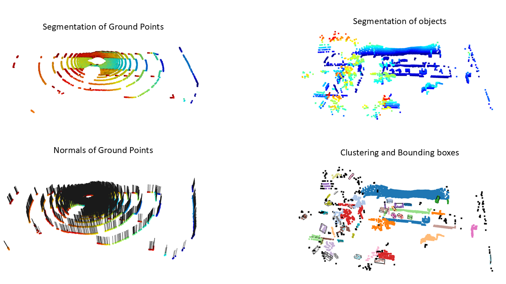
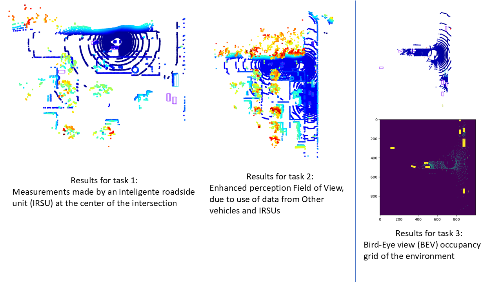

# ecn_auve
Lab assignments from the Autonomous Vehicles course of the master of science in Advanced robotics from École Centrale de Nantes
Dependencies:
- Jupyter notebook
- numpy (pip install numpy)
- Open3D (pip install open3d)
- einops (pip install einops)
- pyquaternion (pip install pyquaternion) 

## Lab 0 - Point cloud filtering and Clustering with Open3D
For this lab assignment we are given a data set with several LiDAR scans from an autonomous vehicle. Our tasks are, to separate the points corresponding to ground and obstacles, and then implement bounding boxes on the obstacles.
For the first task, the first step is to downsample the voxel size and implement python functions to separate the points that correspond to the ground from those that correspond to obstacles. This is done by implementing a threshold on the height of the points (Z coordinates) and on their normal vector direction. Lastly, we remove the points corresponding to the autonomous vehicle itself (mainly the roof, hood and trunk) by implementing a simple threshold on the point's eucledian norm.
For the second task, we use Open3D functions to cluster the points based on the radius of the neighbourhood and the minimum number of points of the cluster (tuned by trial and error).
Lastly, Open3D functions are used to trace the bounding boxes around the relevant objects. Giving a threshold for dimensions of the box allows for less relevant obstacles (i.e. buildings) to be discarded.

## Lab 1 - Colaborative Perception
The goal of this lab was to understand how a network of intelligent transportation can help enhance the field of view of an autonomous vehicle.
In a first moment, we visualize data coming from an Intelligent Road-side Unit  (IRSU), and next, see how the perception data comming from other IRSUs and vehicles gives more information to the ego vehicle, that is now able to perceive more vehicles, objects...
Finally, we filter the perceived objects by extracting just the top corners of their bounding boxes, in order to build a Bird-Eye view of the scene. This is particullarly important, since it allows for image-based perception techniques to be applied.

## Lab 2 - Coming soon
